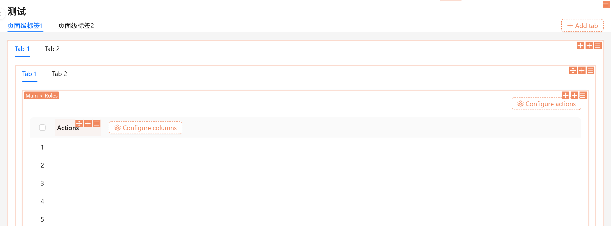

# @nocobase/plugin-block-tabs

[](https://opensource.org/licenses/AGPL-3.0)
[](https://www.nocobase.com/)
[](https://www.typescriptlang.org/)

> A powerful NocoBase plugin that provides tabbed interface components for organizing multiple blocks, reducing page scrolling and improving content organization.

[中文文档](#中文文档) | [English](#)

## 📋 Table of Contents

- [Features](#-features)
- [Screenshots](#-screenshots)
- [Installation](#-installation)
- [Usage](#-usage)
- [Configuration](#-configuration)
- [API Reference](#-api-reference)
- [Architecture](#-architecture)
- [Contributing](#-contributing)
- [License](#-license)

## ✨ Features

- **📑 Tab Management**: Dynamically add, remove, rename, and reorder tabs
- **🎨 Visual Design Mode**: Full support for NocoBase's visual design system
- **📱 Responsive Design**: Automatically adapts to mobile and desktop layouts
- **🔄 Drag & Drop**: Intuitive drag-and-drop support for tab reordering
- **📝 Title & Description**: Customizable block title and description with markdown support
- **🎯 Context-Aware**: Automatically detects page context (page, popup, drawer, mobile)
- **🌐 Internationalization**: Built-in i18n support (English, Chinese)
- **🔧 Schema-Driven**: Fully integrated with NocoBase's schema system
- **♿ Accessible**: Follows accessibility best practices
- **♾️ Infinite Nesting**: **Tabs can be nested infinitely** - you can create tabs within tabs within tabs, allowing for unlimited levels of organization!

## 📸 Screenshots

### 🎯 Infinite Nesting Support

**Block Tabs supports infinite nesting!** You can create tabs within tabs within tabs, allowing for unlimited levels of content organization. This powerful feature enables you to build complex, hierarchical interfaces with ease.



> 💡 **Tip**: You can nest Block Tabs components as deep as you need. Each tab can contain another Block Tabs component, creating a powerful hierarchical structure for organizing your content.

## 🚀 Installation

### Prerequisites

- NocoBase 2.x
- Node.js 16+ and Yarn

### Step 1: Install the Plugin

Copy the plugin directory to your NocoBase project:

```bash
cp -r packages/plugins/@nocobase/plugin-block-tabs /path/to/your/nocobase/packages/plugins/@nocobase/
```

### Step 2: Install Dependencies

```bash
cd /path/to/your/nocobase
yarn install --legacy-peer-deps
```

### Step 3: Build the Plugin

```bash
yarn build @nocobase/plugin-block-tabs --no-dts
```

### Step 4: Enable the Plugin

#### Option A: Via Admin Interface

1. Navigate to **Plugins** in the NocoBase admin interface
2. Find **Block Tabs** in the plugin list
3. Click **Enable**

#### Option B: Via Code

```javascript
import PluginBlockTabsClient from '@nocobase/plugin-block-tabs';

app.plugin(PluginBlockTabsClient);
```

## 📖 Usage

### Basic Usage

1. **Enter Design Mode**: Navigate to your page and enter design mode
2. **Add Block Tabs**: Click **"Add block"** → **"Other blocks"** → **"Block Tabs"**
3. **Default Setup**: The system creates a BlockTabs component with two default tabs
4. **Add Content**: Each tab contains a Grid layout where you can add various blocks (tables, forms, etc.)
5. **Customize**: Use the settings button (⚙️) in the top-right corner to:
   - Edit block title and description
   - Add new tabs
   - Configure tab names and icons
   - Save as template
   - Delete the block

### Adding a New Tab

1. Click the settings button (⚙️) on the BlockTabs component
2. Select **"Add tab"** from the menu
3. Enter the tab name and optionally select an icon
4. Click **"OK"** to create the tab

### Editing Tab Properties

1. Hover over a tab label
2. Click the designer icon that appears
3. Select **"Edit"** from the menu
4. Modify the tab name and icon
5. Click **"OK"** to save changes

### Editing Block Title and Description

1. Click the settings button (⚙️) on the BlockTabs component
2. Select **"Edit block title & description"**
3. Enter the title and description (supports Markdown)
4. Click **"OK"** to save

### Deleting a Tab

1. Hover over the tab label
2. Click the designer icon
3. Select **"Delete"** from the menu
4. Confirm the deletion

## ⚙️ Configuration

### Schema Configuration

The plugin uses NocoBase's schema system. Each BlockTabs component is defined as:

```typescript
{
  type: 'void',
  'x-decorator': 'BlockItem',
  'x-component': 'BlockTabs',
  'x-settings': 'blockTabsSettings',
  properties: {
    [tabUid]: {
      type: 'void',
      title: 'Tab Name',
      'x-component': 'BlockTabs.TabPane',
      'x-component-props': {
        icon: 'IconName',
      },
      properties: {
        grid: {
          type: 'void',
          'x-component': 'Grid',
          'x-initializer': 'page:addBlock',
          properties: {},
        },
      },
    },
  },
}
```

### Component Props

#### BlockTabs

| Prop | Type | Default | Description |
|------|------|---------|-------------|
| `destroyInactiveTabPane` | `boolean` | `true` | Destroy inactive tab panes |
| `tabBarExtraContent` | `object` | - | Extra content in tab bar |

#### BlockTabs.TabPane

| Prop | Type | Default | Description |
|------|------|---------|-------------|
| `icon` | `string` | - | Icon name for the tab |
| `title` | `string` | - | Tab title |
| `hidden` | `boolean` | `false` | Hide the tab |

## 📚 API Reference

### Components

#### `BlockTabs`

Main tabs component that wraps multiple tab panes.

```tsx
<BlockTabs>
  <BlockTabs.TabPane title="Tab 1" icon="FileTextOutlined">
    {/* Content */}
  </BlockTabs.TabPane>
  <BlockTabs.TabPane title="Tab 2">
    {/* Content */}
  </BlockTabs.TabPane>
</BlockTabs>
```

#### `BlockTabs.TabPane`

Individual tab pane component.

```tsx
<BlockTabs.TabPane
  title="My Tab"
  icon="FileTextOutlined"
>
  {/* Tab content */}
</BlockTabs.TabPane>
```

#### `BlockTabsInitializer`

Schema initializer for adding BlockTabs to pages.

#### `blockTabsSettings`

Schema settings configuration for BlockTabs components.

### Hooks

The plugin doesn't expose custom hooks, but integrates with NocoBase's standard hooks:

- `useDesignable()` - For schema manipulation
- `useFieldSchema()` - For accessing schema
- `useField()` - For accessing field instance

## 🏗️ Architecture

This plugin follows NocoBase's microkernel architecture:

### Client Side

- **Components**: `BlockTabs`, `BlockTabs.TabPane`
- **Initializers**: `BlockTabsInitializer` for adding blocks
- **Settings**: `blockTabsSettings` for configuration
- **Localization**: i18n support via locale files

### Server Side

- Minimal server-side implementation (frontend-focused plugin)
- Plugin lifecycle hooks

### Schema System Integration

- Fully integrated with NocoBase's schema system
- Each tab is a schema node with its own properties
- Supports dynamic schema manipulation
- Compatible with all NocoBase block types

### Design Principles

- **Schema-Driven**: Configuration through schema, not code
- **Component-Based**: Extends existing UI components
- **Context-Aware**: Adapts to different contexts (page, popup, mobile)
- **Accessible**: Follows accessibility guidelines

## 🤝 Contributing

Contributions are welcome! Please feel free to submit a Pull Request.

### Development Setup

1. Fork the repository
2. Create your feature branch (`git checkout -b feature/amazing-feature`)
3. Commit your changes (`git commit -m 'Add some amazing feature'`)
4. Push to the branch (`git push origin feature/amazing-feature`)
5. Open a Pull Request

### Code Style

- Follow the existing code style
- Use TypeScript for type safety
- Add tests for new features
- Update documentation as needed

### Reporting Issues

Please use the [GitHub Issues](https://github.com/your-org/plugin-block-tabs/issues) page to report bugs or request features.

## 📄 License

This project is licensed under the **GNU Affero General Public License v3.0 (AGPL-3.0)**.

See the [LICENSE](LICENSE) file for details.


## 🙏 Acknowledgments

- Built for [NocoBase](https://www.nocobase.com/)
- Uses [Ant Design](https://ant.design/) components
- Inspired by the need for better content organization in NocoBase

## 📞 Support

- **Documentation**: See [INSTALL.md](./INSTALL.md) for detailed installation instructions
- **Issues**: [GitHub Issues](https://github.com/your-org/plugin-block-tabs/issues)
- **Discussions**: [GitHub Discussions](https://github.com/your-org/plugin-block-tabs/discussions)

---

## 中文文档

nocobase页面内标签页区块，可提供选项卡式界面组件，用于整合多个区块内容，减少页面滚动操作，提升内容整理效率。详细的中文安装和使用说明，请参阅 [INSTALL.md](./INSTALL.md).

### 🎯 无限嵌套支持

**Block Tabs 支持无限嵌套！** 您可以在标签页中创建标签页，再在标签页中创建标签页，实现无限层级的嵌套结构。这个强大的功能让您能够轻松构建复杂的层次化界面。


> 💡 **提示**：您可以根据需要无限嵌套 Block Tabs 组件。每个标签页都可以包含另一个 Block Tabs 组件，从而创建强大的层次结构来组织您的内容。

### 快速开始

1. **安装插件**：将插件目录复制到 NocoBase 项目的 `packages/plugins/@nocobase/` 目录下
2. **安装依赖**：运行 `yarn install --legacy-peer-deps`
3. **构建插件**：运行 `yarn build @nocobase/plugin-block-tabs --no-dts`
4. **启用插件**：在 NocoBase 管理界面中启用 "Block Tabs" 插件

### 主要功能

- **标签页管理**：动态添加、删除、重命名和排序标签页
- **区块组织**：每个标签页可包含多个区块（表格、表单等）
- **标题和描述**：支持为区块添加标题和描述（支持 Markdown）
- **响应式设计**：自动适配移动端和桌面端
- **拖拽排序**：支持拖拽调整标签页顺序
- **设计模式**：完整的可视化设计和配置功能

更多信息请查看 [INSTALL.md](./INSTALL.md)。

---

**Made with ❤️ for the NocoBase community**
